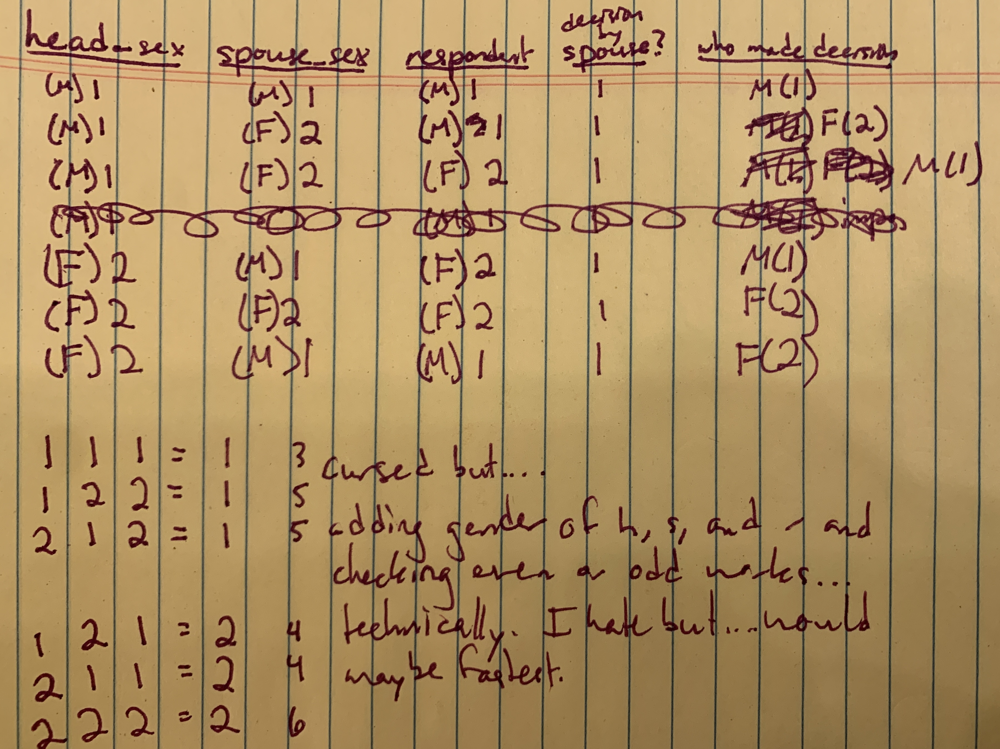

```{r setup, include=FALSE}
knitr::opts_chunk$set(echo = TRUE)
library(tidyverse)
library(moderndive)
library(modelr)
library(haven)
library(purrr)
```

## Importing the data

```{r import}
setwd("C:/Users/scban/Documents/UVA/TSIROBaselineDataAnalysis")
tsiro_raw_data <- read_dta("TSIRO_baseline_public_gender.dta")
view(tsiro_raw_data)
```

## Gender breakdown

In this block, we're counting the number of men and women who are heads of household, spouses, and respondents to each module and figuring out which modules had more male respondents and which had more female respondents.

```{r learning a bit more about gender respondents}

head_sex_count_table <- tsiro_raw_data %>%
  group_by(head_sex)%>%
  count(head_sex)%>%
  rename(sex = head_sex, head_sex = n)
#view(head_sex_count_table)
  
spouse_sex_count_table <- tsiro_raw_data %>%
  group_by(spouse_sex)%>%
  count(spouse_sex)%>%
  rename(sex = spouse_sex, spouse_sex = n)
#view(spouse_sex_count_table)

b_sex_count_table <- tsiro_raw_data %>%
  group_by(mod_b_respondent_sex)%>%
  count(mod_b_respondent_sex)%>%
  rename(sex = mod_b_respondent_sex, roster_respondent_sex = n)

d_sex_count_table <- tsiro_raw_data %>%
  group_by(mod_d_respondent_sex)%>%
  count(mod_d_respondent_sex)%>%
  rename(sex = mod_d_respondent_sex, agriculture_respondent_sex = n)

e_sex_count_table <- tsiro_raw_data %>%
  group_by(mod_e_respondent_sex)%>%
  count(mod_e_respondent_sex)%>%
  rename(sex = mod_e_respondent_sex, credit_respondent_sex = n)

f_sex_count_table <- tsiro_raw_data %>%
  group_by(mod_f_respondent_sex)%>%
  count(mod_f_respondent_sex)%>%
  rename(sex = mod_f_respondent_sex, nat_resources_respondent_sex = n)

g_sex_count_table <- tsiro_raw_data %>%
  group_by(mod_g_respondent_sex)%>%
  count(mod_g_respondent_sex)%>%
  rename(sex = mod_g_respondent_sex, energy_respondent_sex = n)

i_sex_count_table <- tsiro_raw_data %>%
  group_by(mod_i_respondent_sex)%>%
  count(mod_i_respondent_sex)%>%
  rename(poverty_respondent_sex = n)

c_sex_count_table <- tsiro_raw_data %>%
  group_by(mod_c_respondent_sex)%>%
  count(mod_c_respondent_sex)%>%
  rename(sex = mod_c_respondent_sex, health_respondent_sex = n)

c_wdd_sex_count_table <- tsiro_raw_data %>%
  group_by(mod_c_wdd_respondent_sex)%>%
  count(mod_c_wdd_respondent_sex)%>%
  rename(sex = mod_c_wdd_respondent_sex, wdd_respondent_sex = n)

h_sex_count_table <- tsiro_raw_data %>%
  group_by(mod_h_respondent_sex)%>%
  count(mod_h_respondent_sex)%>%
  rename(sex = mod_h_respondent_sex, gender_respondent_sex = n)
#view(h_sex_count_table)


sex_count_table <- list(head_sex_count_table, spouse_sex_count_table, b_sex_count_table, d_sex_count_table, e_sex_count_table, f_sex_count_table, g_sex_count_table, c_sex_count_table, c_wdd_sex_count_table, h_sex_count_table)%>%
  reduce(full_join, by = "sex")%>%
  mutate(sex = toString(sex))%>%
  mutate(sex = ifelse(sex=="1", "M", sex))%>%
  mutate(sex = ifelse(sex=="2", "F", sex))%>%
  #There's 100% a cleaner way to do this
  replace(is.na(.), 0)%>%
  pivot_longer(cols = 2:11, names_to = "categories", values_to = "amount")%>%
  pivot_wider(names_from = sex, values_from = amount)%>%
  arrange(desc(F))

#view(sex_count_table)
```

## Breaking down and cleaning the dataset

Let's start by dividing the dataset into each separate module and making the sex columns easier to understand.

```{r}

tsiro_fm_data <- tsiro_raw_data%>%
  mutate_at(c("head_sex", "spouse_sex", "mod_b_respondent_sex", "mod_c_respondent_sex", "mod_d_respondent_sex", "mod_e_respondent_sex", "mod_f_respondent_sex", "mod_i_respondent_sex", "mod_h_respondent_sex", "mod_g_respondent_sex", "mod_c_wdd_respondent_sex"), as.character)%>%
  mutate(across(c("head_sex", "spouse_sex", "mod_b_respondent_sex", "mod_c_respondent_sex", "mod_d_respondent_sex", "mod_e_respondent_sex", "mod_f_respondent_sex", "mod_i_respondent_sex", "mod_h_respondent_sex", "mod_g_respondent_sex", "mod_c_wdd_respondent_sex"), str_replace, "1", "M"))%>%
  mutate(across(c("head_sex", "spouse_sex", "mod_b_respondent_sex", "mod_c_respondent_sex", "mod_d_respondent_sex", "mod_e_respondent_sex", "mod_f_respondent_sex", "mod_i_respondent_sex", "mod_h_respondent_sex", "mod_g_respondent_sex", "mod_c_wdd_respondent_sex"), str_replace, "2", "F"))
#glimpse(tsiro_raw_data)

roster <- select(tsiro_fm_data, head_sex,spouse_sex,region,hhsize:read_head)
agriculture <- select(tsiro_fm_data, mod_d_respondent_sex, plots:nrm_pract_y)
credit <- select(tsiro_fm_data, mod_e_respondent_sex, loan_ngo:assist_inputs)
resources <- select(tsiro_fm_data, mod_f_respondent_sex, trees:threats_other_EN)
energy <- select(tsiro_fm_data, mod_g_respondent_sex, fuel_sources:fuel_dist1_3)
poverty <- select(tsiro_fm_data, mod_i_respondent_sex, tv:detergent)
foodsec <- select(tsiro_fm_data, mod_c_respondent_sex, mod_c_wdd_respondent_sex, fies_enough:mddw)
empower <- select(tsiro_fm_data, mod_h_respondent_sex, partner:alone)

view(roster)
view(agriculture)
view(credit)
view(resources)
view(energy)
view(poverty)
view(foodsec)
view(empower)
```


#### Adding gender back into credit section

starting w some planning...(and thinking out loud in R markdown)

basically...

M+a1 = M

  I, a man, made this decision.  Possibly by myself and possibly with my wife.
  
M+a0 = not M

  I, a man, did not make this decision.  Possibilities: wife made this decision, decision wasn't made at all.
  
F+a1 = F

  I, a woman, made this decision.  Possibly by myself and possibly with my husband.
  
F+a0 = not F

  I, a woman, did not make this decision.  Possibilities: husband made this decision, decision wasn't made at all
  
M+b1 = F

  My spouse, theoretically a woman, made this decision.  Possibilities: I made it with her or she made it by herself.
  update: not necessarily a woman.  Need to double-check spouse's gender.
  
M+b0 = not F

  My spouse, theoretically a woman, did not make this decision.  Possibilities: I made it without her or neither of us made it.
  
F+b1 = M

F+b0 = not M

realizing this assumes every couple in the dataset is straight.  going to check real quick to make sure this is an assumption I can make.  update: it's not.  love that they've found love but darn it messes up my math.

after, I'm imagining each set of columns looking like:

did you borrow from x?

options: 1 (yes), 0 (no)

who made the decision to borrow from x?

options: "M", "F", "MF", "N", "S", "MS", "FS", "MFS", where N is no one and S is someone else (inside or outside household)

factor it by power of the woman in the decision? kinda hard to define, so no

who decided how to use money from x?

options: "M", "F", "MF", "N", "S", "MS", "FS", "MFS", where N is no one and S is someone else (inside or outside household)

etc. for each institution

ok how do I want to go about this?

Might be easiest to create a column M or 0, F or 0, S or 0, and then add them together.  Any still 0 will become N.

Don't bother w columns where the value is 0 - it doesn't provide info that isn't provided elsewhere.

change self to M, F, and 0.  change spouse to M, F, and 0.  change both other columns to S and 0.  concatenate all four into one column.

How to tackle the spouse column?



```{r}
non_straight_households <- tsiro_fm_data%>%
  filter(head_sex == spouse_sex)
#view(non_straight_households)
#I consider myself an ally but...darnit.  the gays are messing up my math.
#let's check if they actually borrowed money - ie if I actually have to adjust the code.
non_straight_households_credit <- non_straight_households%>%
  select(mod_e_respondent_sex, loan_ngo:assist_inputs)
#view(non_straight_households_credit)
#ok one of the MM households borrowed from a friend and both spouses contributed to the decision.  I'll structure the code around this.
#I'll take all this out (the above stuff) later, just keeping it for reference now.

credit_gender <- credit %>%
#changes borrow_(institution)_y to say whether they did (1) or didn't (0) borrow from the institution.
  mutate(borrow_ngo_y = abs(replace_na(borrow_ngo_y, 1)-1), borrow_formal_y = abs(replace_na(borrow_formal_y, 1)-1), borrow_informal_y = abs(replace_na(borrow_informal_y, 1)-1), borrow_friend_y = abs(replace_na(borrow_friend_y, 1)-1), borrow_group_y = abs(replace_na(borrow_group_y, 1)-1), borrow_sav_y = abs(replace_na(borrow_sav_y, 1)-1))

#get ready for the world's longest pipe - I spent two days trying to find a way
#to avoid this, to no avail.
credit_gender_b <- tsiro_raw_data%>%
  select(head_sex, spouse_sex, mod_e_respondent_sex, loan_ngo:assist_inputs)%>%
  mutate(borrow_ngo_y = abs(replace_na(borrow_ngo_y, 1)-1),
         use_ngo_y = abs(replace_na(use_ngo_y, 1)-1),
         borrow_formal_y = abs(replace_na(borrow_formal_y, 1)-1), 
         use_formal_y = abs(replace_na(use_formal_y, 1)-1),
         borrow_informal_y = abs(replace_na(borrow_informal_y, 1)-1), 
         use_informal_y = abs(replace_na(use_informal_y, 1)-1),
         borrow_friend_y = abs(replace_na(borrow_friend_y, 1)-1), 
         use_friend_y = abs(replace_na(use_friend_y, 1)-1),
         borrow_group_y = abs(replace_na(borrow_group_y, 1)-1), 
         use_group_y = abs(replace_na(use_group_y, 1)-1),
         borrow_sav_y = abs(replace_na(borrow_sav_y, 1)-1),
         use_sav_y = abs(replace_na(use_sav_y, 1)-1))%>%
  # repeat starting here
  mutate(borrow_ngo_self = borrow_ngo_a*mod_e_respondent_sex, 
         borrow_ngo_spouse = abs(((head_sex+spouse_sex+mod_e_respondent_sex)%%2)-2)*borrow_ngo_b, 
         borrow_ngo_inside = borrow_ngo_c*3, 
         borrow_ngo_outside = borrow_ngo_d*4, .before = use_ngo)%>%
  mutate(across(c("borrow_ngo_self", "borrow_ngo_spouse", "borrow_ngo_inside",
        "borrow_ngo_outside"), as.character))%>%
  mutate_at(vars(borrow_ngo_self:borrow_ngo_outside), ~ str_replace(., "1", "M"))%>%
  mutate_at(vars(borrow_ngo_self:borrow_ngo_outside), ~ str_replace(., "2", "F"))%>%
  mutate_at(vars(borrow_ngo_self:borrow_ngo_outside), ~ str_replace(., "3", "I"))%>%
  mutate_at(vars(borrow_ngo_self:borrow_ngo_outside), ~ str_replace(., "4", "O"))%>%
  mutate_at(vars(borrow_ngo_self:borrow_ngo_outside), ~ str_replace(., "0", ""))%>%
  unite(borrow_ngo_gender, borrow_ngo_self, borrow_ngo_spouse, borrow_ngo_inside,
        borrow_ngo_outside, sep = "", na.rm = TRUE)%>%
  mutate(borrow_ngo_gender = sapply(lapply(strsplit(borrow_ngo_gender, NULL),
        sort), paste, collapse=""))%>%
  # repeat starting here
  mutate(use_ngo_self = use_ngo_a*mod_e_respondent_sex, 
         use_ngo_spouse = abs(((head_sex+spouse_sex+mod_e_respondent_sex)%%2)-2)*use_ngo_b, 
         use_ngo_inside = use_ngo_c*3, 
         use_ngo_outside = use_ngo_d*4, .before = loan_informal)%>%
  mutate(across(c("use_ngo_self", "use_ngo_spouse", "use_ngo_inside",
        "use_ngo_outside"), as.character))%>%
  mutate_at(vars(use_ngo_self:use_ngo_outside), ~ str_replace(., "1", "M"))%>%
  mutate_at(vars(use_ngo_self:use_ngo_outside), ~ str_replace(., "2", "F"))%>%
  mutate_at(vars(use_ngo_self:use_ngo_outside), ~ str_replace(., "3", "I"))%>%
  mutate_at(vars(use_ngo_self:use_ngo_outside), ~ str_replace(., "4", "O"))%>%
  mutate_at(vars(use_ngo_self:use_ngo_outside), ~ str_replace(., "0", ""))%>%
  unite(use_ngo_gender, use_ngo_self, use_ngo_spouse, use_ngo_inside,
        use_ngo_outside, sep = "", na.rm = TRUE)%>%
  mutate(use_ngo_gender = sapply(lapply(strsplit(use_ngo_gender, NULL),
        sort), paste, collapse=""))%>%
  # repeat starting here
  mutate(borrow_informal_self = borrow_informal_a*mod_e_respondent_sex, 
         borrow_informal_spouse = abs(((head_sex+spouse_sex+mod_e_respondent_sex)%%2)-2)*borrow_informal_b, 
         borrow_informal_inside = borrow_informal_c*3, 
         borrow_informal_outside = borrow_informal_d*4, .before = use_informal)%>%
  mutate(across(c("borrow_informal_self", "borrow_informal_spouse", "borrow_informal_inside",
        "borrow_informal_outside"), as.character))%>%
  mutate_at(vars(borrow_informal_self:borrow_informal_outside), ~ str_replace(., "1", "M"))%>%
  mutate_at(vars(borrow_informal_self:borrow_informal_outside), ~ str_replace(., "2", "F"))%>%
  mutate_at(vars(borrow_informal_self:borrow_informal_outside), ~ str_replace(., "3", "I"))%>%
  mutate_at(vars(borrow_informal_self:borrow_informal_outside), ~ str_replace(., "4", "O"))%>%
  mutate_at(vars(borrow_informal_self:borrow_informal_outside), ~ str_replace(., "0", ""))%>%
  unite(borrow_informal_gender, borrow_informal_self, borrow_informal_spouse, borrow_informal_inside,
        borrow_informal_outside, sep = "", na.rm = TRUE)%>%
  mutate(borrow_informal_gender = sapply(lapply(strsplit(borrow_informal_gender, NULL),
        sort), paste, collapse=""))%>%
  # repeat starting here
  mutate(use_informal_self = use_informal_a*mod_e_respondent_sex, 
         use_informal_spouse = abs(((head_sex+spouse_sex+mod_e_respondent_sex)%%2)-2)*use_informal_b, 
         use_informal_inside = use_informal_c*3, 
         use_informal_outside = use_informal_d*4, .before = loan_formal)%>%
  mutate(across(c("use_informal_self", "use_informal_spouse", "use_informal_inside",
        "use_informal_outside"), as.character))%>%
  mutate_at(vars(use_informal_self:use_informal_outside), ~ str_replace(., "1", "M"))%>%
  mutate_at(vars(use_informal_self:use_informal_outside), ~ str_replace(., "2", "F"))%>%
  mutate_at(vars(use_informal_self:use_informal_outside), ~ str_replace(., "3", "I"))%>%
  mutate_at(vars(use_informal_self:use_informal_outside), ~ str_replace(., "4", "O"))%>%
  mutate_at(vars(use_informal_self:use_informal_outside), ~ str_replace(., "0", ""))%>%
  unite(use_informal_gender, use_informal_self, use_informal_spouse, use_informal_inside,
        use_informal_outside, sep = "", na.rm = TRUE)%>%
  mutate(use_informal_gender = sapply(lapply(strsplit(use_informal_gender, NULL),
        sort), paste, collapse=""))%>%
  # repeat starting here
  mutate(borrow_formal_self = borrow_formal_a*mod_e_respondent_sex, 
         borrow_formal_spouse = abs(((head_sex+spouse_sex+mod_e_respondent_sex)%%2)-2)*borrow_formal_b, 
         borrow_formal_inside = borrow_formal_c*3, 
         borrow_formal_outside = borrow_formal_d*4, .before = use_formal)%>%
  mutate(across(c("borrow_formal_self", "borrow_formal_spouse", "borrow_formal_inside",
        "borrow_formal_outside"), as.character))%>%
  mutate_at(vars(borrow_formal_self:borrow_formal_outside), ~ str_replace(., "1", "M"))%>%
  mutate_at(vars(borrow_formal_self:borrow_formal_outside), ~ str_replace(., "2", "F"))%>%
  mutate_at(vars(borrow_formal_self:borrow_formal_outside), ~ str_replace(., "3", "I"))%>%
  mutate_at(vars(borrow_formal_self:borrow_formal_outside), ~ str_replace(., "4", "O"))%>%
  mutate_at(vars(borrow_formal_self:borrow_formal_outside), ~ str_replace(., "0", ""))%>%
  unite(borrow_formal_gender, borrow_formal_self, borrow_formal_spouse, borrow_formal_inside,
        borrow_formal_outside, sep = "", na.rm = TRUE)%>%
  mutate(borrow_formal_gender = sapply(lapply(strsplit(borrow_formal_gender, NULL),
        sort), paste, collapse=""))%>%
  # repeat starting here
  mutate(use_formal_self = use_formal_a*mod_e_respondent_sex, 
         use_formal_spouse = abs(((head_sex+spouse_sex+mod_e_respondent_sex)%%2)-2)*use_formal_b, 
         use_formal_inside = use_formal_c*3, 
         use_formal_outside = use_formal_d*4, .before = loan_group)%>%
  mutate(across(c("use_formal_self", "use_formal_spouse", "use_formal_inside",
        "use_formal_outside"), as.character))%>%
  mutate_at(vars(use_formal_self:use_formal_outside), ~ str_replace(., "1", "M"))%>%
  mutate_at(vars(use_formal_self:use_formal_outside), ~ str_replace(., "2", "F"))%>%
  mutate_at(vars(use_formal_self:use_formal_outside), ~ str_replace(., "3", "I"))%>%
  mutate_at(vars(use_formal_self:use_formal_outside), ~ str_replace(., "4", "O"))%>%
  mutate_at(vars(use_formal_self:use_formal_outside), ~ str_replace(., "0", ""))%>%
  unite(use_formal_gender, use_formal_self, use_formal_spouse, use_formal_inside,
        use_formal_outside, sep = "", na.rm = TRUE)%>%
  mutate(use_formal_gender = sapply(lapply(strsplit(use_formal_gender, NULL),
        sort), paste, collapse=""))%>%
  # repeat starting here
  mutate(borrow_group_self = borrow_group_a*mod_e_respondent_sex, 
         borrow_group_spouse = abs(((head_sex+spouse_sex+mod_e_respondent_sex)%%2)-2)*borrow_group_b, 
         borrow_group_inside = borrow_group_c*3, 
         borrow_group_outside = borrow_group_d*4, .before = use_group)%>%
  mutate(across(c("borrow_group_self", "borrow_group_spouse", "borrow_group_inside",
        "borrow_group_outside"), as.character))%>%
  mutate_at(vars(borrow_group_self:borrow_group_outside), ~ str_replace(., "1", "M"))%>%
  mutate_at(vars(borrow_group_self:borrow_group_outside), ~ str_replace(., "2", "F"))%>%
  mutate_at(vars(borrow_group_self:borrow_group_outside), ~ str_replace(., "3", "I"))%>%
  mutate_at(vars(borrow_group_self:borrow_group_outside), ~ str_replace(., "4", "O"))%>%
  mutate_at(vars(borrow_group_self:borrow_group_outside), ~ str_replace(., "0", ""))%>%
  unite(borrow_group_gender, borrow_group_self, borrow_group_spouse, borrow_group_inside,
        borrow_group_outside, sep = "", na.rm = TRUE)%>%
  mutate(borrow_group_gender = sapply(lapply(strsplit(borrow_group_gender, NULL),
        sort), paste, collapse=""))%>%
  # repeat starting here
  mutate(use_group_self = use_group_a*mod_e_respondent_sex, 
         use_group_spouse = abs(((head_sex+spouse_sex+mod_e_respondent_sex)%%2)-2)*use_group_b, 
         use_group_inside = use_group_c*3, 
         use_group_outside = use_group_d*4, .before = loan_sav)%>%
  mutate(across(c("use_group_self", "use_group_spouse", "use_group_inside",
        "use_group_outside"), as.character))%>%
  mutate_at(vars(use_group_self:use_group_outside), ~ str_replace(., "1", "M"))%>%
  mutate_at(vars(use_group_self:use_group_outside), ~ str_replace(., "2", "F"))%>%
  mutate_at(vars(use_group_self:use_group_outside), ~ str_replace(., "3", "I"))%>%
  mutate_at(vars(use_group_self:use_group_outside), ~ str_replace(., "4", "O"))%>%
  mutate_at(vars(use_group_self:use_group_outside), ~ str_replace(., "0", ""))%>%
  unite(use_group_gender, use_group_self, use_group_spouse, use_group_inside,
        use_group_outside, sep = "", na.rm = TRUE)%>%
  mutate(use_group_gender = sapply(lapply(strsplit(use_group_gender, NULL),
        sort), paste, collapse=""))%>%
  # repeat starting here
  mutate(borrow_sav_self = borrow_sav_a*mod_e_respondent_sex, 
         borrow_sav_spouse = abs(((head_sex+spouse_sex+mod_e_respondent_sex)%%2)-2)*borrow_sav_b, 
         borrow_sav_inside = borrow_sav_c*3, 
         borrow_sav_outside = borrow_sav_d*4, .before = loan_sav)%>%
  mutate(across(c("borrow_sav_self", "borrow_sav_spouse", "borrow_sav_inside",
        "borrow_sav_outside"), as.character))%>%
  mutate_at(vars(borrow_sav_self:borrow_sav_outside), ~ str_replace(., "1", "M"))%>%
  mutate_at(vars(borrow_sav_self:borrow_sav_outside), ~ str_replace(., "2", "F"))%>%
  mutate_at(vars(borrow_sav_self:borrow_sav_outside), ~ str_replace(., "3", "I"))%>%
  mutate_at(vars(borrow_sav_self:borrow_sav_outside), ~ str_replace(., "4", "O"))%>%
  mutate_at(vars(borrow_sav_self:borrow_sav_outside), ~ str_replace(., "0", ""))%>%
  unite(borrow_sav_gender, borrow_sav_self, borrow_sav_spouse, borrow_sav_inside,
        borrow_sav_outside, sep = "", na.rm = TRUE)%>%
  mutate(borrow_sav_gender = sapply(lapply(strsplit(borrow_sav_gender, NULL),
        sort), paste, collapse=""))%>%
  # repeat starting here
  mutate(use_sav_self = use_sav_a*mod_e_respondent_sex, 
         use_sav_spouse = abs(((head_sex+spouse_sex+mod_e_respondent_sex)%%2)-2)*use_sav_b, 
         use_sav_inside = use_sav_c*3, 
         use_sav_outside = use_sav_d*4, .before = group_ag)%>%
  mutate(across(c("use_sav_self", "use_sav_spouse", "use_sav_inside",
        "use_sav_outside"), as.character))%>%
  mutate_at(vars(use_sav_self:use_sav_outside), ~ str_replace(., "1", "M"))%>%
  mutate_at(vars(use_sav_self:use_sav_outside), ~ str_replace(., "2", "F"))%>%
  mutate_at(vars(use_sav_self:use_sav_outside), ~ str_replace(., "3", "I"))%>%
  mutate_at(vars(use_sav_self:use_sav_outside), ~ str_replace(., "4", "O"))%>%
  mutate_at(vars(use_sav_self:use_sav_outside), ~ str_replace(., "0", ""))%>%
  unite(use_sav_gender, use_sav_self, use_sav_spouse, use_sav_inside,
        use_sav_outside, sep = "", na.rm = TRUE)%>%
  mutate(use_sav_gender = sapply(lapply(strsplit(use_sav_gender, NULL),
        sort), paste, collapse=""))
 view(credit_gender_b)
 credit_gender_narrow <- credit_gender_b %>%
   select(head_sex:mod_e_respondent_sex, ends_with("gender"), ends_with("_y"), group_ag:assist_inputs)
 view(credit_gender_narrow)
 
 credit_gender_consolidated <- credit_gender_narrow%>%
   unite(decion_makers, ends_with("gender"), sep="")%>%
   view()
```


## Miscellaneous Planning - it's old (pre-analysis), so don't worry about this part

Maybe try to incorporate in a gender empowerment index, based on SWPER but modified to this dataset?  Replace unavailable data w similar or similarly relevant data?

Would love to have biodiversity data - it would really add to this

Definitely incorporate score on how much they care about protecting the environment

Is it possible to make a sustainability index?  Should probably incorporate harmful activities (how much deforestation, weighted percentage of unclean fuel use, destructive agriculture practices) and helpful activities (reforestation, resource conservation, sustainably agriculture practices)

Is there a good poverty indicator?  Maybe ask Kelvin's advice on this

